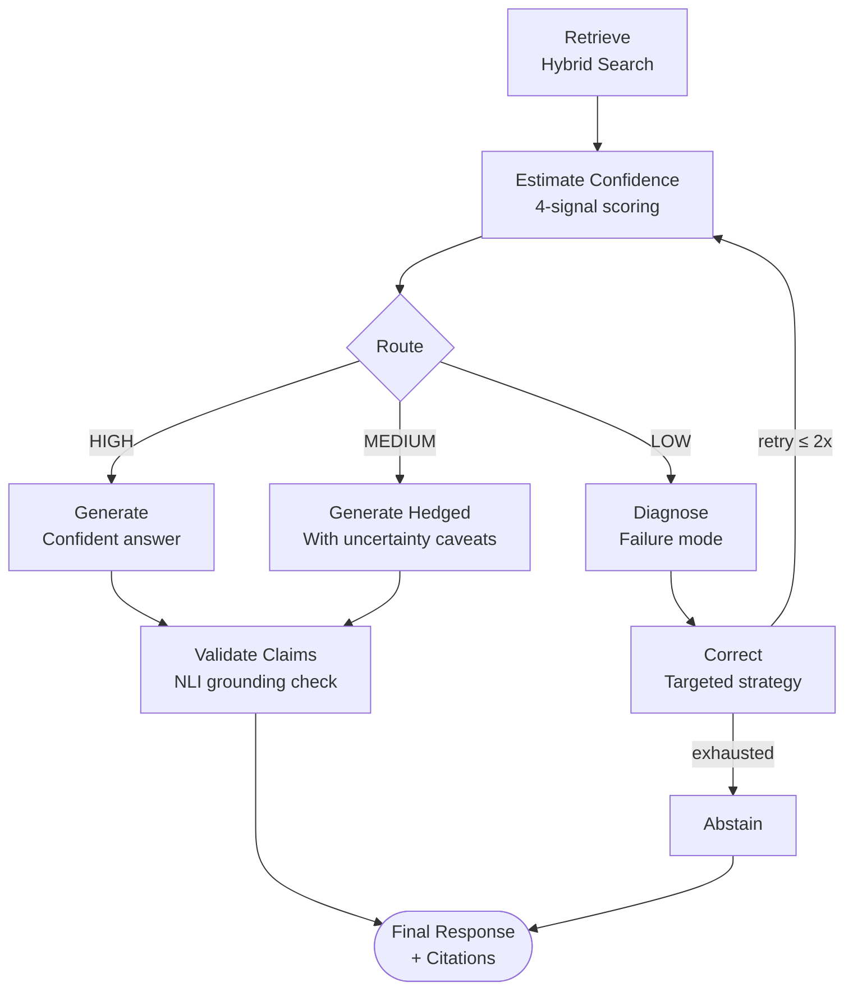
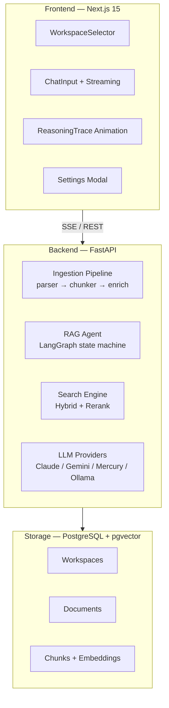

<h1 align="center">Self-Healing RAG Engine</h1>

<p align="center"><em>Production-grade Retrieval-Augmented Generation with confidence-calibrated retrieval and agentic self-correction</em></p>

<p align="center">
  
  
  
  
  
  
</p>

<p align="center">
  <a href="#overview">Overview</a> •
  <a href="#key-features">Features</a> •
  <a href="#architecture">Architecture</a> •
  <a href="#getting-started">Quick Start</a> •
  <a href="#api-endpoints">API</a> •
  <a href="#bring-your-own-models">BYOM</a>
</p>

---

## Overview

This RAG engine goes beyond basic vector retrieval by implementing a **self-healing architecture** that evaluates, diagnoses, and corrects its own retrieval before generating a response. When confidence is low, the system automatically identifies the failure mode and applies a targeted correction strategy rather than silently hallucinating.

| Standard RAG | Self-Healing RAG |
|---|---|
| Retrieve → Generate | Retrieve → **Evaluate Confidence** → **Diagnose** → **Correct** → Generate |
| Hopes for good results | Measures retrieval quality with multi-signal scoring |
| Hallucinates when context is poor | Abstains or self-corrects when uncertain |
| Single retrieval strategy | Hybrid search (vector + keyword + HyDE) with RRF fusion |
| Fixed model | **Bring your own models** — any provider, per task |

---

## Key Features

### Agentic Self-Correction Loop

The core is a LangGraph state machine that implements intelligent, confidence-gated retrieval correction:



**Confidence Estimation** uses four orthogonal signals:

| Signal | What It Measures |
|---|---|
| **Top Score** | Best retrieval similarity — baseline quality |
| **Score Dropoff** | Gap between top results — specificity indicator |
| **Inter-chunk Coherence** | Semantic consistency across returned chunks |
| **Query Coverage** | LLM-assessed relevance to actual query intent |

**Failure Modes** diagnosed and corrected automatically:

- `AMBIGUITY` — query is too broad; correction rewrites with disambiguation
- `VOCAB_MISMATCH` — terminology gap; correction expands with synonyms
- `INFO_SCATTER` — relevant content is fragmented; correction broadens retrieval
- `KNOWLEDGE_GAP` — content genuinely not in corpus; triggers abstention

### Hybrid Search with Reciprocal Rank Fusion

Three complementary strategies fused via RRF:

| Strategy | Weight | Purpose |
|---|---|---|
| **Vector Search** | 40% | Semantic similarity via BGE-M3 (1024-dim) |
| **Keyword Search** | 20% | Exact term matching via PostgreSQL `tsvector` |
| **HyDE Search** | 40% | Match against hypothetical question embeddings |

### Multi-Workspace Knowledge Bases

Isolate documents into named workspaces, each with its own search scope:

- Create workspaces with custom names, colors, and icons
- Upload documents to specific workspaces; queries are scoped per workspace
- Switch between workspaces or search across all

### Glassmorphism Frontend (Next.js 15)

Dark-mode UI with cinematic reasoning visualization:

- Animated mesh gradient background with noise overlay
- 5-phase reasoning trace animation (Vectorizing → Searching → Confidence → Self-Healing → Generating)
- SSE streaming with typewriter text reveal
- Inline citations with hover tooltips showing source excerpts
- Drag-and-drop document upload
- Settings panel for API keys and model selection

### Bring Your Own Models

Configure API keys and model selection from the Settings UI (⚙️ in header):

| Provider | Models | Use Case |
|---|---|---|
| **Anthropic** | Claude Opus, Sonnet, Haiku | Agents, generation |
| **Google** | Gemini 2.0 Flash / Pro | Fast generation |
| **Mercury 2** | mercury-2 | 10× faster inference (~1000 tok/s) |
| **OpenAI** | GPT-4o, GPT-4o-mini | Agents, generation |
| **Ollama** | Llama 3.2, Mistral, etc. | Local / private models |

Settings are stored locally in the browser. Per-task model selection lets you use a fast model for agent loops and a stronger model for final generation.

---

## Architecture



### Tech Stack

| Layer | Technology |
|---|---|
| **Embeddings** | `BAAI/bge-m3` — 1024-dim dense |
| **Reranker** | `BAAI/bge-reranker-v2-m3` — cross-encoder |
| **Orchestration** | LangGraph state machine |
| **Backend** | FastAPI, SQLAlchemy 2.0 (async) |
| **Database** | PostgreSQL + pgvector (Neon) |
| **Frontend** | Next.js 15, Tailwind CSS, Framer Motion |
| **Observability** | OpenTelemetry (optional) |

---

## Getting Started

### Prerequisites

- Python 3.11+
- Node.js 18+
- PostgreSQL with the `pgvector` extension — or a [Neon](https://neon.tech) cloud database
- At least one LLM API key (Anthropic and/or Google required for default config)

### Backend Setup

```bash
# Clone the repository
git clone https://github.com/Gustav-Proxi/RAG.git
cd RAG

# Create virtual environment
python -m venv venv
source venv/bin/activate   # Windows: venv\Scripts\activate

# Install all dependencies
pip install -e .

# Configure environment
cp .env.example .env
# Edit .env — set DATABASE_URL, ANTHROPIC_API_KEY, GOOGLE_API_KEY at minimum

# Start the API server (auto-creates tables on first run)
python -m uvicorn src.api.main:app --port 8000
```

### Frontend Setup

```bash
cd frontend
npm install
npm run dev
```

Open **http://localhost:3000** to access the UI.

### Quick Ingest

```bash
# Ingest a document from the CLI
rag-ingest --file path/to/document.pdf --workspace my-workspace
```

---

## API Endpoints

### Core

| Method | Endpoint | Description |
|---|---|---|
| `GET` | `/health` | Health check with DB stats |
| `POST` | `/ingest` | Upload and process a document |
| `POST` | `/query` | RAG query — full pipeline |
| `POST` | `/query/stream` | Streaming query via SSE |
| `POST` | `/search` | Direct search without generation |

### Documents

| Method | Endpoint | Description |
|---|---|---|
| `GET` | `/documents` | List all documents |
| `DELETE` | `/documents/{id}` | Delete a document |

### Workspaces

| Method | Endpoint | Description |
|---|---|---|
| `GET` | `/workspaces` | List workspaces |
| `POST` | `/workspaces` | Create a workspace |
| `GET` | `/workspaces/{id}` | Workspace details |
| `PUT` | `/workspaces/{id}` | Update a workspace |
| `DELETE` | `/workspaces/{id}` | Delete a workspace |

### Settings

| Method | Endpoint | Description |
|---|---|---|
| `GET` | `/settings/providers` | List available LLM providers |
| `POST` | `/settings/validate-key` | Validate an API key |
| `POST` | `/settings/user` | Save user settings |

### Example Query

```bash
curl -X POST http://localhost:8000/query \
  -H "Content-Type: application/json" \
  -d '{"query": "What is this document about?", "workspace_id": "optional-uuid"}'
```

Response fields:

| Field | Description |
|---|---|
| `response` | Generated answer |
| `citations` | Source chunks with relevance scores |
| `confidence_score` | 0–1 confidence rating |
| `confidence_band` | `high` / `medium` / `low` |
| `correction_attempts` | Number of self-correction loops run |

---

## Environment Variables

### Required

| Variable | Description |
|---|---|
| `DATABASE_URL` | PostgreSQL connection string (`postgresql+asyncpg://...`) |
| `ANTHROPIC_API_KEY` | Claude API key — used for agent loops |
| `GOOGLE_API_KEY` | Gemini API key — used for default generation |

### Optional

| Variable | Default | Description |
|---|---|---|
| `EMBEDDING_MODEL` | `BAAI/bge-m3` | Embedding model |
| `EMBEDDING_DEVICE` | `cpu` | `cpu`, `cuda`, or `mps` |
| `AGENT_MODEL` | `claude-haiku-4-20250514` | Model for agent/diagnosis steps |
| `GENERATION_MODEL` | `claude-sonnet-4-20250514` | Model for final generation |
| `RETRIEVAL_TOP_K` | `20` | Candidates before reranking |
| `RERANK_TOP_K` | `5` | Final context window size |
| `CONFIDENCE_HIGH_THRESHOLD` | `0.75` | Threshold for HIGH band |
| `CONFIDENCE_LOW_THRESHOLD` | `0.45` | Threshold for LOW band |
| `MAX_CORRECTION_LOOPS` | `2` | Max self-correction iterations |

### Mercury 2 — 10× Faster Inference

[Mercury 2](https://www.inceptionlabs.ai/blog/introducing-mercury-2) from Inception Labs uses diffusion-based parallel generation for ~1000 tokens/second.

| Variable | Description |
|---|---|
| `MERCURY_API_KEY` | Inception Labs API key ([get one here](https://platform.inceptionlabs.ai)) |
| `USE_MERCURY_FOR_AGENTS` | `true` to use Mercury for agent loops |
| `USE_MERCURY_FOR_GENERATION` | `true` to use Mercury for response generation |
| `MERCURY_REASONING_EFFORT` | `low` (faster) or `high` (better quality) |

**Speed comparison:**

| Model | Speed | Cost / 1M output tokens |
|---|---|---|
| Mercury 2 | ~1000 tok/s | $0.75 |
| Claude Haiku | ~89 tok/s | $1.25 |
| Gemini Flash | ~150 tok/s | $0.30 |

---

## Project Structure

```
RAG/
├── src/
│   ├── api/              # FastAPI routes and middleware
│   ├── agents/           # LangGraph self-correction state machine
│   │   ├── graph.py      # State machine definition and nodes
│   │   ├── diagnosis.py  # Failure mode detection
│   │   └── correction.py # Correction strategies per failure mode
│   ├── retrieval/        # Search and ranking
│   │   ├── search.py     # Hybrid search (vector + keyword + HyDE)
│   │   ├── fusion.py     # Reciprocal Rank Fusion
│   │   ├── reranker.py   # Cross-encoder reranking
│   │   └── confidence.py # Multi-signal confidence scoring
│   ├── ingestion/        # Document processing pipeline
│   │   ├── parser.py     # PDF / DOCX / Markdown parsing
│   │   ├── chunker.py    # Chunking strategies
│   │   └── pipeline.py   # Orchestration
│   ├── generation/       # Response generation and planning
│   ├── validation/       # Claim grounding via NLI
│   ├── embeddings/       # BGE-M3 embedding wrapper
│   ├── providers/        # LLM provider integrations (Mercury, etc.)
│   ├── database/         # SQLAlchemy async models and connection
│   └── config/           # Settings, constants, circuit breaker
├── frontend/
│   └── src/
│       ├── app/          # Next.js pages and layout
│       └── components/   # React components (Chat, Workspace, Settings…)
├── docs/
│   └── MERCURY_2_ANALYSIS.md
├── tests/
│   ├── unit/             # Unit tests (chunker, confidence)
│   └── adversarial/      # Adversarial robustness tests
└── scripts/
    ├── ingest.py         # CLI document ingestion
    └── evaluate.py       # RAGAS-based evaluation harness
```

---

## Testing

```bash
# Run all tests
pytest tests/ -v

# Unit tests only
pytest tests/unit/ -v

# With coverage report
pytest tests/ --cov=src --cov-report=term-missing
```

---

## Contributing

1. Fork the repository
2. Create a feature branch: `git checkout -b feature/your-feature`
3. Commit your changes: `git commit -m 'Add your feature'`
4. Push to the branch: `git push origin feature/your-feature`
5. Open a Pull Request

---

<div align="center">
  <p>Built by <a href="https://linkedin.com/in/vaishakgkumar">Vaishak G Kumar</a></p>
</div>
